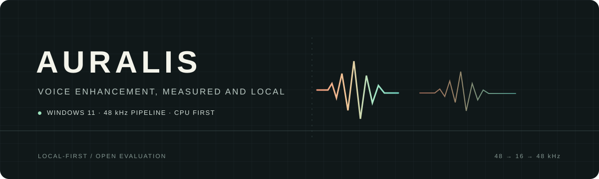
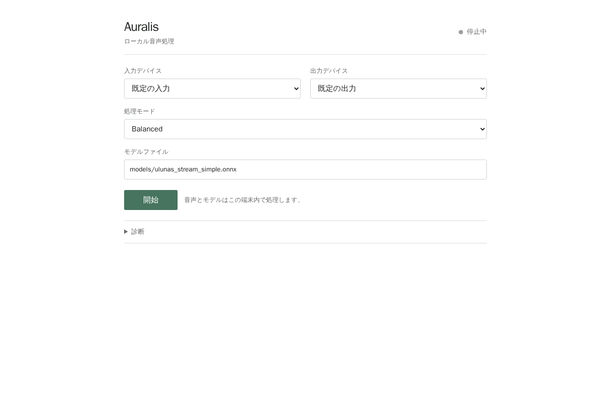

  
  
<a href="README.md">日本語</a> · <strong>English</strong>

  

    
    
    
  

  

# Auralis

**Reduce background noise from your microphone and hear the processed voice on your PC.** Auralis is a real-time speech-denoising app for Windows 11; audio stays local.

  
   Monitor processed microphone audio through your selected headphones.

## What you can do

- Reduce background noise from live microphone audio
- Select input/output devices and processing profile in the GUI
- View CPU, inference, queue, underrun and xrun diagnostics
- Keep captured audio on the PC; it is not uploaded

## Get started

1. [Download the Windows x64 app](https://huggingface.co/j-llm/Auralis/resolve/main/Auralis-Windows-x64.zip) and extract it.
2. Double-click `start-auralis.cmd`. On first launch it downloads and verifies the pinned model.
3. Select your microphone and headphones, then choose **Balanced → Start**.

Requires Windows 11 x64 and the Microsoft Visual C++ 2015–2022 x64 Runtime. Internet is only used to fetch the model on first launch. Headphones are recommended.

## Not supported yet

- Virtual microphone input for Discord/Teams
- Acoustic echo cancellation or target-speaker isolation
- Audio bandwidth above the model's 8 kHz limit

## Measurements

Evaluation and real-time results

- UL-UNAS: mean SI-SDR **7.025 dB** and STOI change **+0.0057** across 630 noisy cases
- Native Windows 11: 30-minute run with zero losses/underruns/xruns; inference p95 **1.35 ms**
- Accounted software-path latency: **89.3 ms average**; physical mic-to-speaker latency is not measured.
- No blind listening has been done; objective metrics do not represent preference or naturalness.

More: [measurements](docs/milestone-3-results.md) · [methodology](docs/benchmark-methodology.md) · [latency](docs/latency-budget.md)

The model weights were created upstream by [Xiaobin-Rong/UL-UNAS](https://github.com/Xiaobin-Rong/ul-unas), not by Auralis. See the [model card](https://huggingface.co/j-llm/Auralis) for the license and SHA-256.

Auralis source code: [Apache-2.0](LICENSE).
